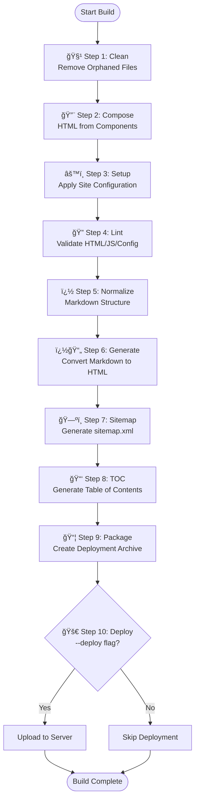

# GAZ Tank Build Pipeline

## Pipeline Overview

The complete build pipeline consists of 10 sequential steps that transform source files into deployable website packages.

```mermaid
graph TD
    Start([Start Build]) --> Step1[🧹 Step 1: Clean<br/>Remove Orphaned Files]
    Step1 --> Step2[🔨 Step 2: Compose<br/>HTML from Components]
    Step2 --> Step3[âš™ï¸ Step 3: Setup<br/>Apply Site Configuration]
    Step3 --> Step4[🔠Step 4: Lint<br/>Validate HTML/JS/Config]
    Step4 --> Step5[� Step 5: Normalize<br/>Markdown Structure]
    Step5 --> Step6[�📄 Step 6: Generate<br/>Convert Markdown to HTML]
    Step6 --> Step7[ğŸ—ºï¸ Step 7: Sitemap<br/>Generate sitemap.xml]
    Step7 --> Step8[📑 Step 8: TOC<br/>Generate Table of Contents]
    Step8 --> Step9[📦 Step 9: Package<br/>Create Deployment Archive]
    Step9 --> Step10{🚀 Step 10: Deploy<br/>--deploy flag?}
    Step10 -- Yes --> Deploy[Upload to Server]
    Step10 -- No --> Skip[Skip Deployment]
    Deploy --> End([Build Complete])
    Skip --> End
```

